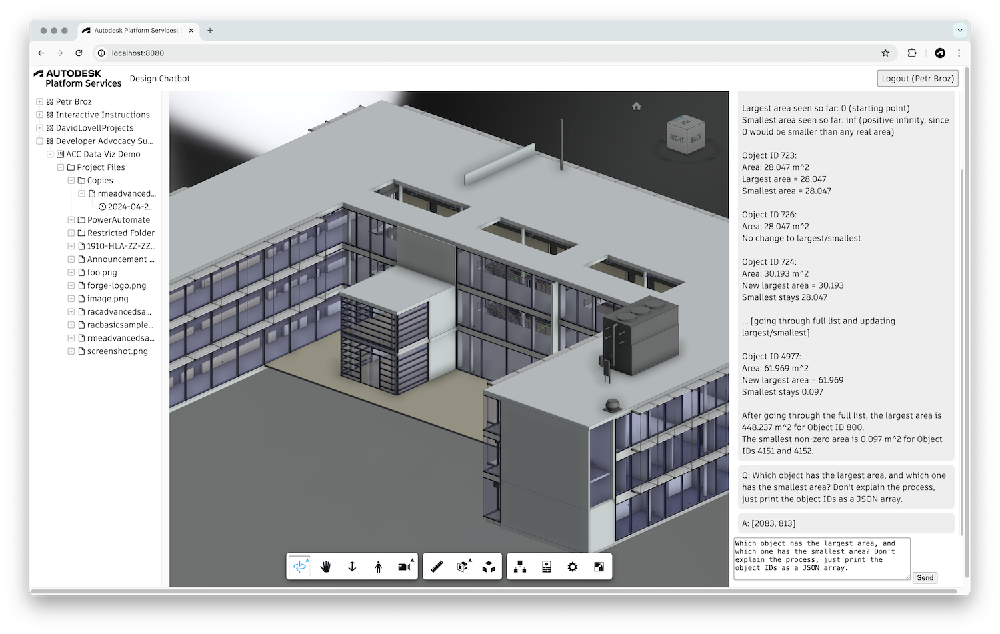

# aps-design-chatbot

Simple chatbot for querying metadata of designs in [Autodesk Platform Services](https://aps.autodesk.com) using [Amazon Bedrock](https://aws.amazon.com/bedrock).

## Development

### Prerequisites

- [APS credentials](https://aps.autodesk.com/en/docs/oauth/v2/tutorials/create-app)
- AWS credentials with access to Amazon Bedrock
- Provisioned access to [BIM 360 Docs](https://aps.autodesk.com/en/docs/bim360/v1/tutorials/getting-started/manage-access-to-docs/)
or Autodesk Construction Cloud
- [Node.js](https://nodejs.org) (Long Term Support version is recommended)
- Command-line terminal such as [PowerShell](https://learn.microsoft.com/en-us/powershell/scripting/overview)
or [bash](https://en.wikipedia.org/wiki/Bash_(Unix_shell))

### Setup & Run

- Clone this project
- Install dependencies: `npm install`
- Specify the following environment variables:
  - `APS_CLIENT_ID` - your APS application client ID
  - `APS_CLIENT_SECRET` - your APS application client secret
  - `APS_CALLBACK_URL` - your OAuth callback
    - For local development, it should be http://localhost:8080/auth/callback
    - Don't forget to add the same URL to your APS application in https://aps.autodesk.com/myapps as well
  - `SERVER_SESSION_SECRET` - custom phrase used to encrypt/decrypt cookies
  - `AWS_ACCESS_KEY_ID` - your AWS access key ID
  - `AWS_SECRET_ACCESS_KEY` - your AWS secret access key
- Run the server: `npm start`
- Go to http://localhost:8080